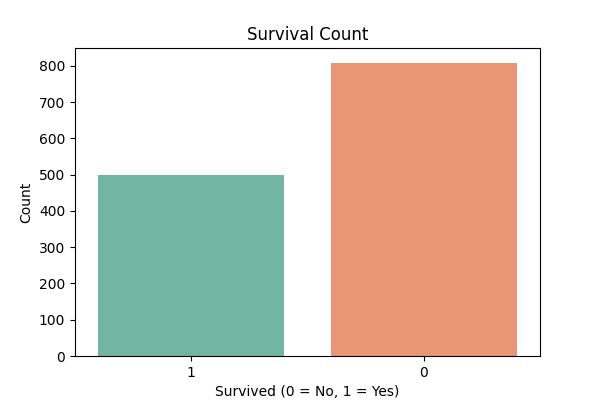
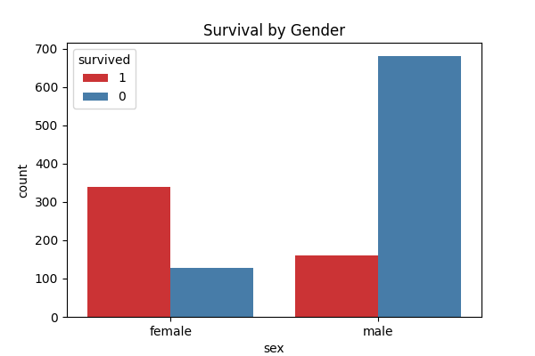
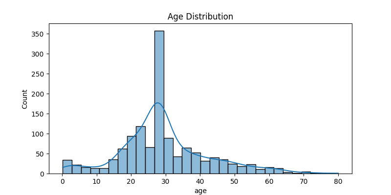
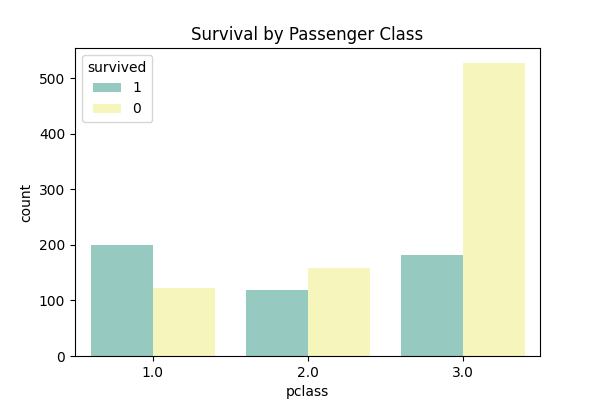
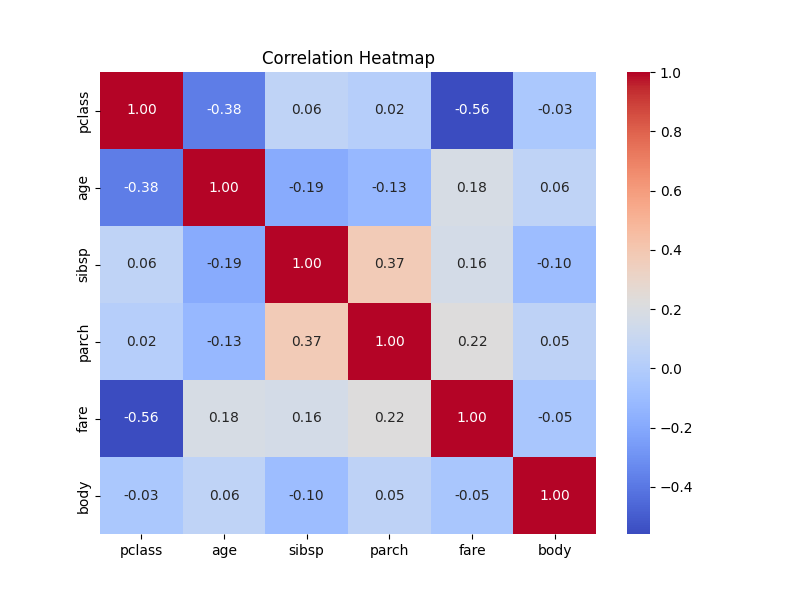

# 📊 Task 2 - Data Cleaning & Exploratory Data Analysis (EDA) on Titanic Dataset  

**👩‍💻 Internship:** SkillCraft Technology  
**✍️ Author:** Piyush Patil  
**📂 Task:** 2 – Data Cleaning & EDA  

---

## 📝 **Objective**
The aim of this task was to:
- Perform **data cleaning** (handle missing values, convert data types, remove duplicates)
- Conduct **exploratory data analysis (EDA)** to extract meaningful insights
- Visualize key patterns and relationships in the Titanic dataset

---

## 🧹 **Data Cleaning Steps**
✔ Converted `age` & `fare` columns to numeric format  
✔ Filled missing values:
  - **Age** → Median  
  - **Fare** → Median  
  - **Embarked** → Mode (most frequent value)  
✔ Removed duplicate rows (if any)  
✔ Exported cleaned dataset → **`cleaned_titanic.csv`**

---

## 📊 **Exploratory Data Analysis**

### 🔢 Survival Count
Shows distribution of passengers who survived vs. those who did not.

---

### 👩‍👩‍👧 Survival by Gender
Women had a higher survival rate compared to men.

---

### 📈 Age Distribution
Majority of passengers were between **20-40 years old**.

---

### 🛳 Survival by Passenger Class
1st class passengers had a much higher chance of survival compared to 2nd and 3rd class.

---

### 🔥 Correlation Heatmap
Fare and class are strongly correlated with survival probability.

---

## 📂 **Files in This Folder**
| File | Description |
|------|-------------|
| **task2.py** | Main Python script for data cleaning & EDA |
| **phpMYEkMl.arff** | Original Titanic dataset |
| **cleaned_titanic.csv** | Cleaned dataset after processing |
| **eda_survival_count.png** | Bar plot of survival count |
| **eda_survival_by_gender.png** | Survival by gender |
| **eda_age_distribution.png** | Histogram of age distribution |
| **eda_survival_by_class.png** | Survival rate by passenger class |
| **eda_correlation_heatmap.png** | Heatmap showing correlations |

---

## 📌 **Results & Insights**
- Women had a higher survival rate than men  
- 1st class passengers were more likely to survive  
- Most passengers were between **20–40 years old**  
- Fare and class are positively correlated with survival  

---

## ⚙️ **Tech Stack**
- **Python** 🐍
- **Pandas** – Data Cleaning & Analysis  
- **Matplotlib & Seaborn** – Visualization  
- **Scipy / Arff** – Dataset Loading  

---

## ✅ **Conclusion**
This task demonstrates:
- How to clean raw datasets and handle missing values
- How to generate meaningful insights from EDA
- How visualizations can reveal patterns and relationships in data  

This cleaned dataset and analysis can serve as a strong foundation for further tasks like **feature engineering** and **machine learning modeling**.

---

## 🔗 **Connect with Me**
📌 **GitHub:** https://github.com/piyushpatil-art  
📌 **LinkedIn:** www.linkedin.com/in/piyushpatil06

---

> ⭐ *If you found this project helpful, don’t forget to star the repository!*
q
