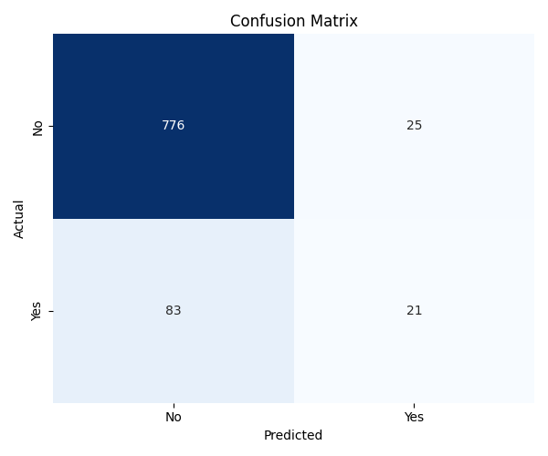
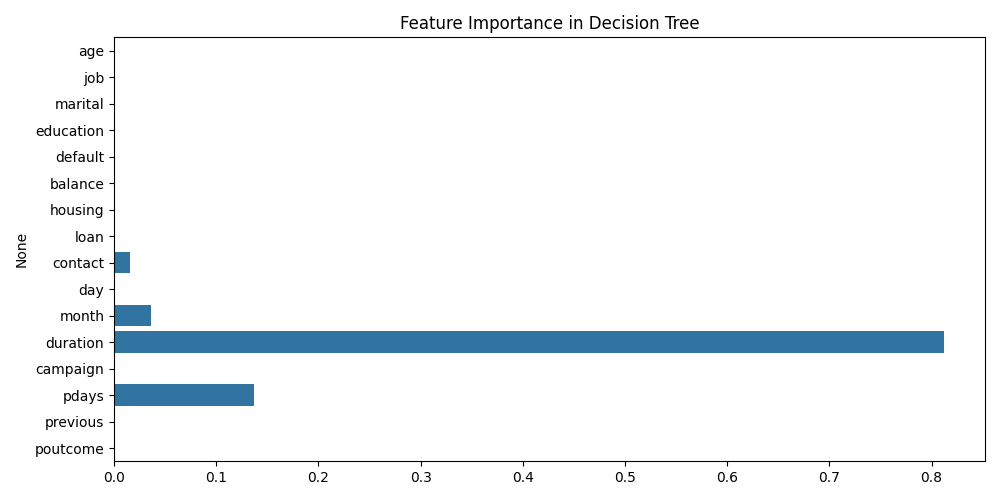

# 🌳 Task 3 – Decision Tree Classifier  

## 📌 Overview  
In this task, I built a **Decision Tree Classifier** to predict whether a customer will purchase a product or service based on their **demographic and behavioral data**.  

The **Bank Marketing Dataset** from the [UCI Machine Learning Repository](https://archive.ics.uci.edu/ml/datasets/bank+marketing) was used for this project.  

---

## 🗂 Documents Included  
- **task3.py** → Python source code for training and evaluating the Decision Tree Classifier.  
- **decision_tree_visual.png** → Visualization of the trained Decision Tree.  
- **confusion_matrix.png** → Confusion Matrix showing model performance.  
- **feature_importance.png** → Bar plot of feature importance scores.  
- **README.md** → Documentation of this task.  

---

## 🛠️ Tools & Libraries Used  
- **Python**  
- **Scikit-learn** → Model building, evaluation, decision tree visualization.  
- **Matplotlib** → Plotting and visualizations.  
- **Seaborn** → Heatmaps and advanced plots.  
- **Pandas** → Data preprocessing and handling.  
- **NumPy** → Numerical operations.  

---

## 📊 Model Building Steps  
1. **Dataset Preprocessing**  
   - Loaded the Bank Marketing dataset.  
   - Encoded categorical variables.  
   - Handled missing values (if any).  
   - Split data into training and testing sets.  

2. **Model Training**  
   - Implemented a **Decision Tree Classifier** using `scikit-learn`.  
   - Tuned hyperparameters like `max_depth` and `criterion`.  

3. **Evaluation**  
   - Used **confusion matrix**, **accuracy score**, and **classification report**.  
   - Plotted feature importance to understand key predictors.  

4. **Visualization**  
   - Generated the decision tree structure.  
   - Plotted confusion matrix heatmap.  
   - Displayed top important features.  

---

## 📈 Results  
- **Decision Tree Visualization**  
    

- **Confusion Matrix**  
    

- **Feature Importance**  
    

---

## ✨ Key Learnings  
- Understood how decision trees classify categorical & numerical data.  
- Learned how to interpret **confusion matrices** and **feature importance**.  
- Practiced **data preprocessing** for real-world datasets.  
- Visualized decision trees to better explain predictions.  

---

## 🔗 References  
- [Bank Marketing Dataset – UCI Repository](https://archive.ics.uci.edu/ml/datasets/bank+marketing)  
- [Scikit-learn Documentation](https://scikit-learn.org/stable/)  
- [Matplotlib Documentation](https://matplotlib.org/)  
- [Seaborn Documentation](https://seaborn.pydata.org/)  

---
