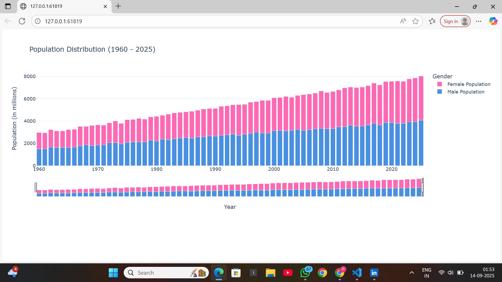

# SkillCraft Data Science Internship

A repository containing all tasks completed as part of my **Data Science Internship** at **SkillCraft Technology**.  
This project is aimed at practicing **data visualization, data analysis, and machine learning** techniques in Python.

---

## 📌 Tasks Completed
- **Task 01:** Bar chart / histogram to visualize data distribution
- **Task 02:** (Will be added soon)

---


## 🛠 Technologies Used
- Python
- VS Code (Code editor)
- Matplotlib / Pandas / NumPy

---

## 📊 Output Preview (Task 01)


---

## 🚀 How to Run
Clone the repo and open the notebook:
```bash
git clone https://github.com/your-username/SkillCraft-DataScience-Internship.git
cd SkillCraft-DataScience-Internship/Task_01_BarChart
python task_01.py

---

## 🤝 Connect With Me
- **LinkedIn:** [www.linkedin.com/in/piyushpatil06](https://www.linkedin.com/in/piyushpatil06)
- **GitHub:** [https://github.com/piyushpatil-art](https://github.com/piyushpatil-art)

---

## 📄 License
This project is for educational purposes only.
